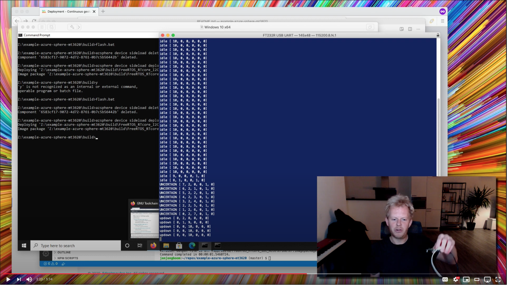

# Edge Impulse example on Azure Sphere MT3620

This is an example application that runs an embedded Machine Learning model on the *realtime core* of an Azure Sphere MT3620 board, classifying data coming in on the accelerometer. At [Edge Impulse](https://edgeimpulse.com) we enable developers to create the next generation of intelligent device solutions with embedded Machine Learning - especially when it comes to running ML models on microcontrollers.

**Note:** This is a demonstration, not a fully supported Edge Impulse target.

[](https://www.youtube.com/watch?v=rDuKwONerZI&amp;feature=youtu.be)

## Prerequisites

You'll need:

* [Azure Sphere MT3620 Starter Kit](https://www.avnet.com/shop/us/products/avid-technologies/aes-ms-mt3620-sk-g-3074457345636825680/).
* [SparkFun FTDI Basic Breakout board](https://www.sparkfun.com/products/9873) (3.3V) or an FTDI cable to see logs from the realtime cores. Hook TX on the mikrobus 2 slot up to RX on the SparkFun board, and GND to GND. The board is logging information on baud rate 115,200.

You'll also need:

* [Docker desktop](https://www.docker.com/products/docker-desktop) - to build the firmware.
* A Windows 10 VM with the Azure SDK installed. I couldn't get this to work on Linux (let alone macOS). Make sure `azsphere` is in your PATH, and you've followed the steps to [claim your device](https://docs.microsoft.com/en-us/azure-sphere/install/claim-device) and to [enable development and debugging](https://docs.microsoft.com/en-us/azure-sphere/install/qs-real-time-application?tabs=windows&pivots=cli#enable-development-and-debugging).

## Building and flashing the example (Docker)

1. Build the container with all dependencies:

    ```
    $ docker build -t azure-sphere .
    ```

1. Build the firmware:

    ```
    $ docker run --rm -it -v $PWD:/app azure-sphere /bin/bash /app/build/build.sh
    ```

1. Mount the `build` folder to your Windows 10 VM, open a command prompt and navigate to the `build` folder. Then run:

    ```
    $ flash.bat
    ```

1. You should now see data coming in from the FTDI Breakout board.


## Building and flashing the example (locally installed Azure Sphere SDK - Linux only)

1. Build the firmware:

    ```
    $ sh ./build/build.sh
    ```

1. Mount the `build` folder to your Windows 10 VM, open a command prompt and navigate to the `build` folder. Then run:

    ```
    $ flash.bat
    ```

1. You should now see data coming in from the FTDI Breakout board.

## Updating your ML model

To update the ML model you'll need a model trained on accelerometer data in Edge Impulse ([tutorial here](https://docs.edgeimpulse.com/docs/continuous-motion-recognition)). At the moment we don't have full support for data collection from the Azure Sphere, but you can use the [data forwarder](https://docs.edgeimpulse.com/docs/cli-data-forwarder) to stream accelerometer data, or use your [mobile phone](https://docs.edgeimpulse.com/docs/using-your-mobile-phone) to do so. Then:

1. Remove the `model-parameters` and `tflite-model` folders (in the `source` directory).
1. In the Edge Impulse Studio go to **Deployment**, and export as **C++ Library**.
1. Drag the `model-parameters` and `tflite-model` from the ZIP into the `source` directory.
1. Recompile your application, and you're good to go 🚀

> **Note:** Don't update the `edge-impulse-sdk` folder. It contains modifications to work with the Azure Sphere.
